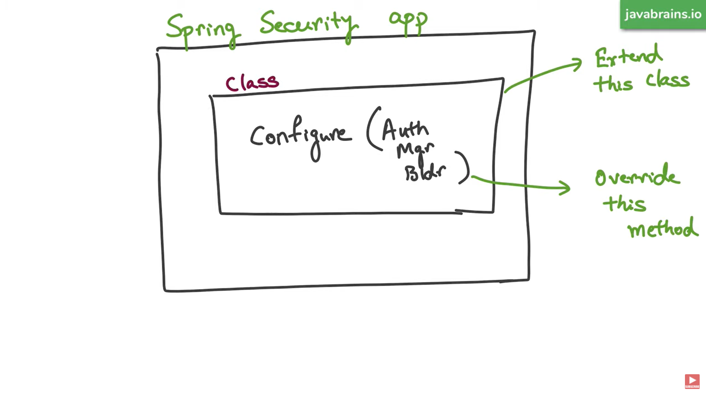
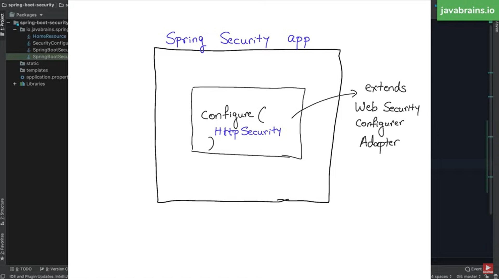
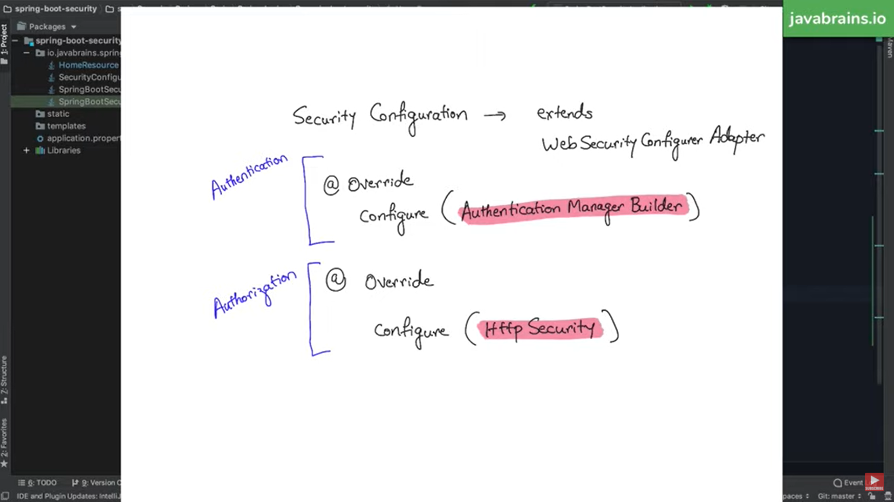
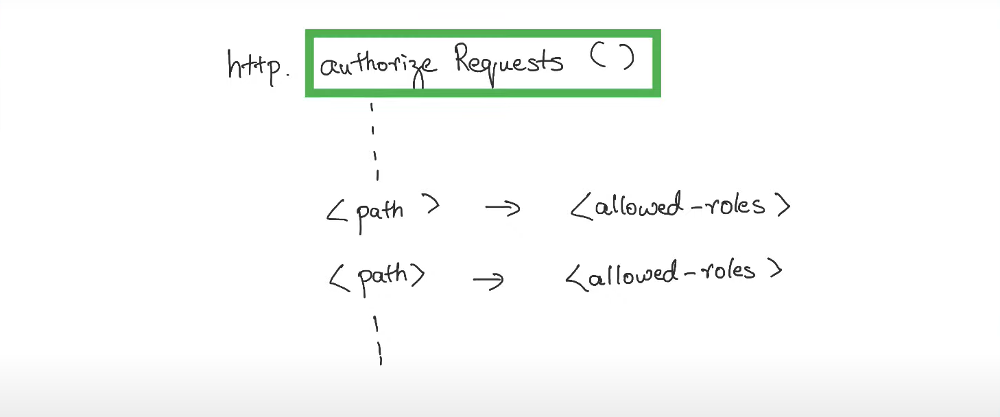
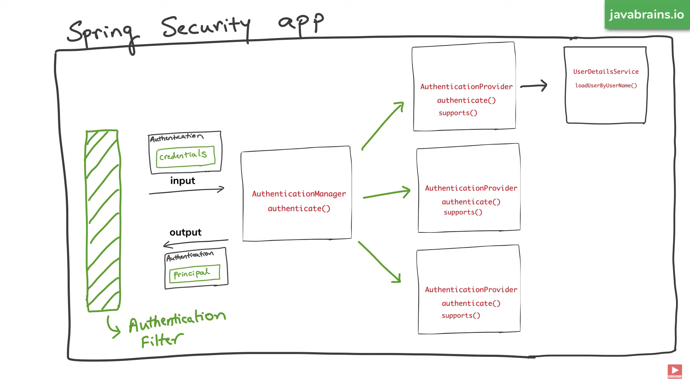

## Notes

1) Interact with `AuthenticationManagerBuilder`, which indirectly interacts
with `AuthenticationManager`. Override `configure` method that passes `AuthenticationManagerBuilder` as a
parameter. Manipulate the argument to override authentication configuration. 

2) Override `configure` method that passes `HttpSecurity` to configure Authorization.

3) Internal working

4) JDBC authentication: Override `configure` method and set the data source. Create users and authorities table and
populate them.
